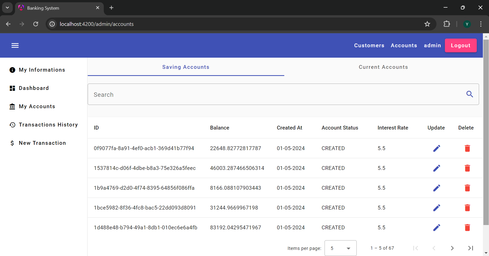

# Banking System

## Login:

## User Part

### Main Page

### User Details

### User Accounts

### User Transaction History

### User New Transaction

## Admin Part

The admin has the same capabilities as the user, with additional features including the ability to add, update, and delete customers and accounts.

### Customers

### Accounts

